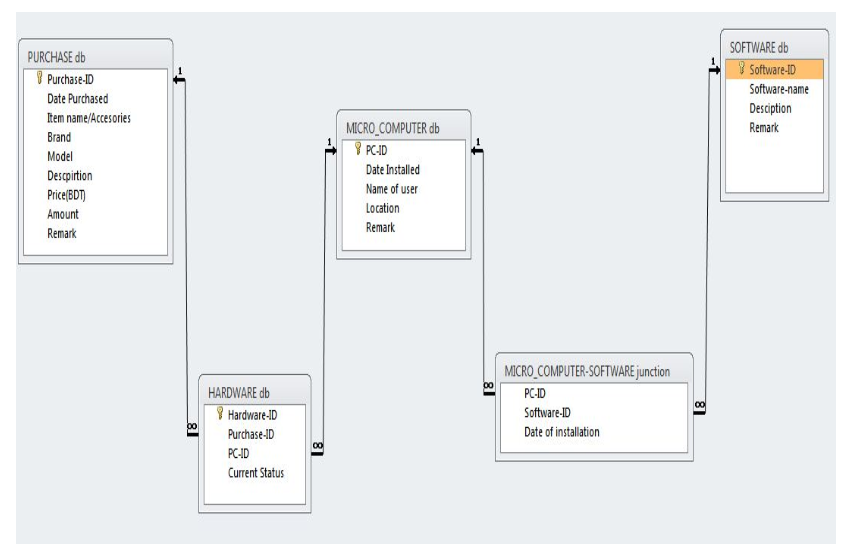

# IUT Computer Centre Management System (2012)

A desktop-based application (using Java Swing, JDBC, Itext report, Jfree-chart; Database: Oracle) capable of maintaining all data and data manipulation logic necessary to improve the administrative works of a computer lab in university perspective. All the reporting on different queries regarding the present locations and availability system units and accessories.

* The main purpose is to automate the computer center management system.
* Reduce paperwork and make the best use of a database.

## Relationship schema

## Sample reports:
* [Purchase report](sample_reports/Report201281012443.pdf)
* [Admin info](sample_reports/Report20133152573.pdf)
* [Software Information](sample_reports/Report2012915102548.pdf)

## Contributing
Pull requests are welcome. For major changes, please open an issue first to discuss what you would like to change.

## License
[MIT](https://choosealicense.com/licenses/mit/)